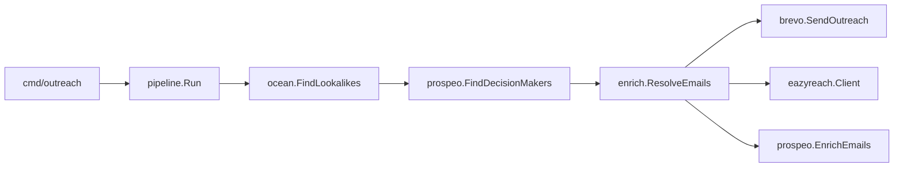

# Outreach Pipeline

A fully automated cold-outreach engine written in Go. A human provides **one seed company domain** — the system handles everything after that: finding similar companies, identifying decision-makers, resolving verified work emails, and sending personalized outreach. No copy-paste, no manual handoffs between stages.


<video src="https://github.com/user-attachments/assets/fbc2ddae-be18-421b-bfdd-544652109684" controls width="100%"></video>


```
Human input: company.domain
       │
       ▼
┌─────────────┐    ┌─────────────┐    ┌─────────────┐    ┌─────────────┐
│  Stage 1    │    │  Stage 2    │    │  Stage 3    │    │  Stage 4    │
│  Ocean.io   │───▶│  Prospeo    │───▶│  Eazyreach  │───▶│  Brevo      │
│  lookalikes │    │  contacts   │    │  emails     │    │  send mail  │
└─────────────┘    └─────────────┘    └─────────────┘    └─────────────┘
  []Company          []Contact          []Contact          []OutreachResult
```

Built as a single CLI binary with modular stage packages, automatic pagination, retry logic, deduplication, and a safety checkpoint before any email is sent.

---

## Table of contents

- [What it does](#what-it-does)
- [Quick start](#quick-start)
- [Prerequisites & account setup](#prerequisites--account-setup)
- [Usage](#usage)
- [Architecture](#architecture)
- [Project structure](#project-structure)
- [Data model](#data-model)
- [Execution flow](#execution-flow)
- [Stage 1 — Ocean.io](#stage-1--oceanio)
- [Stage 2 — Prospeo](#stage-2--prospeo)
- [Stage 3 — Email resolution](#stage-3--email-resolution)
- [Stage 4 — Brevo](#stage-4--brevo)
- [Safety checkpoint](#safety-checkpoint)
- [Configuration reference](#configuration-reference)
- [CLI reference](#cli-reference)
- [Shared infrastructure](#shared-infrastructure)
- [Resilience & edge cases](#resilience--edge-cases)
- [Customizing outreach copy](#customizing-outreach-copy)
- [Building & testing](#building--testing)
- [License](#license)

---

## What it does

Given a seed domain like `stripe.com` — a company you already know is a strong customer — the pipeline:

1. **Expands** the seed into lookalike companies (similar size, industry, market)
2. **Finds** C-suite and VP-level decision-makers at those companies, with LinkedIn URLs
3. **Resolves** each LinkedIn profile into a verified work email
4. **Sends** a personalized cold-outreach email to each contact

Every stage's output feeds the next automatically. The only human touchpoints are the initial domain input and an optional confirmation prompt before emails go out.

---

## Quick start

```bash
# 1. Clone and configure
cp .env.example .env
# Fill in API keys (see Configuration reference)

# 2. Build
go build -o outreach ./cmd/outreach

# 3. Dry run — stages 1–3, no emails sent
./outreach --domain stripe.com --dry-run

# 4. Full run with safety checkpoint
./outreach --domain stripe.com
```

Start with small limits while testing to conserve API credits:

```bash
./outreach --domain stripe.com --dry-run --max-companies 5 --max-per-company 2
```

---

## Prerequisites & account setup

| Requirement | Details |
|-------------|---------|
| **Go** | 1.22 or later |
| **Domain & company email** | Recommended: claim a free domain via [GitHub Student Developer Pack](https://education.github.com/pack), then set up `you@yourdomain.com` |
| **Ocean.io** | [ocean.io](https://ocean.io) — requires a company email to sign up |
| **Prospeo** | [prospeo.io](https://prospeo.io) — free API access |
| **Eazyreach** | [eazyreach.app](https://eazyreach.app) — API key from [docs.eazyreach.app/api-keys](https://docs.eazyreach.app/api-keys) |
| **Brevo** | [brevo.com](https://brevo.com) — free tier includes 300 emails/day |

**Setup order matters:** domain → company email → Ocean.io account → remaining services. Ocean.io requires a company email during registration.

---

## Usage

### Dry run (recommended first)

Runs sourcing, contact discovery, and email enrichment. Prints a summary table. Does **not** call Brevo.

```bash
./outreach --domain stripe.com --dry-run
```

### Full pipeline

Runs all four stages. Shows a summary and prompts for confirmation before sending.

```bash
./outreach --domain stripe.com
```

### Skip confirmation

Use with care — sends immediately after the summary.

```bash
./outreach --domain stripe.com --yes
```

### Tune volume

```bash
./outreach --domain stripe.com \
  --max-companies 10 \
  --max-per-company 1
```

---

## Architecture

The pipeline follows a **one-package-per-stage** design. Each stage is a self-contained HTTP client with a single public method. An orchestrator in `internal/pipeline/` chains them together and owns the safety checkpoint.



Stage 3 is routed through `internal/enrich/`, which selects the email resolution provider based on configuration (`auto`, `eazyreach`, or `prospeo`).

---

## Project structure

```
outreach-pipeline/
├── cmd/outreach/
│   └── main.go                 # CLI entrypoint, flags, .env loading
├── internal/
│   ├── pipeline/
│   │   └── pipeline.go         # Orchestrator — chains stages, safety checkpoint
│   ├── ocean/
│   │   └── client.go           # Stage 1 — lookalike company search
│   ├── prospeo/
│   │   ├── client.go           # Stage 2 — decision-maker search
│   │   └── enrich.go           # Prospeo enrich-person (email resolution)
│   ├── eazyreach/
│   │   └── client.go           # Stage 3 — LinkedIn → work email
│   ├── enrich/
│   │   └── resolver.go         # Email provider routing (auto / eazyreach / prospeo)
│   ├── brevo/
│   │   └── client.go           # Stage 4 — transactional email send
│   ├── email/
│   │   └── template.go         # Personalized outreach copy
│   ├── models/
│   │   └── models.go           # Shared types between stages
│   ├── config/
│   │   ├── config.go           # Environment variable loading & validation
│   │   └── dotenv.go           # .env file loader (walks up directories)
│   ├── httpclient/
│   │   └── client.go           # Shared HTTP client with retries
│   └── util/
│       ├── domain.go           # Domain normalization
│       └── log.go              # Structured stderr logging
├── .env.example
├── go.mod
└── README.md
```

---

## Data model

Defined in `internal/models/models.go`. Each stage enriches the same struct — no intermediate file formats or manual transforms.

### `Company` (after Stage 1)

| Field | Description |
|-------|-------------|
| `Domain` | Normalized company domain (e.g. `adyen.com`) |
| `Name` | Company display name |

### `Contact` (Stages 2–4)

| Field | Set by | Description |
|-------|--------|-------------|
| `PersonID` | Prospeo search | Prospeo internal ID — used for enrichment |
| `FirstName`, `LastName`, `FullName` | Prospeo search | Contact identity |
| `JobTitle` | Prospeo search | Current role |
| `LinkedInURL` | Prospeo search | Public LinkedIn profile URL |
| `CompanyDomain`, `CompanyName` | Prospeo search | Associated company |
| `Email`, `EmailStatus` | Stage 3 | Verified work email and status |

### `OutreachResult` (after Stage 4)

| Field | Description |
|-------|-------------|
| `Contact` | The contact that was emailed |
| `Sent` | Whether Brevo accepted the send |
| `Message` | Brevo `messageId` on success, error text on failure |

---

## Execution flow

### 1. CLI startup (`cmd/outreach/main.go`)

1. Loads `.env` from the current directory or any parent (so it works regardless of where you invoke the binary)
2. Parses flags: `--domain`, `--dry-run`, `--yes`, `--max-companies`, `--max-per-company`
3. Builds `config.Config` and validates required API keys
4. Creates a cancellable context (Ctrl+C stops in-flight requests)
5. Calls `pipeline.New(cfg).Run(ctx, domain)`

### 2. Pipeline orchestration (`internal/pipeline/pipeline.go`)

```
NormalizeDomain(seed)
  │
  ├─ Stage 1: ocean.FindLookalikes(seed)         → []Company
  ├─ Stage 2: prospeo.FindDecisionMakers(domains) → []Contact
  ├─ Stage 3: enricher.ResolveEmails(contacts)  → []Contact (with emails)
  ├─ printSummary()                               → review table
  ├─ confirmSend()                                → [y/N] unless --yes or --dry-run
  └─ Stage 4: brevo.SendOutreach(contacts)        → []OutreachResult
```

The pipeline fails fast if a required stage returns zero results. Partial failures within a stage (e.g. one contact missing an email) are handled inside that stage and do not crash the run.

---

## Stage 1 — Ocean.io

**Package:** `internal/ocean/`  
**Method:** `Client.FindLookalikes(ctx, seedDomain, max)`  
**Input:** One seed domain string  
**Output:** `[]models.Company`

### Purpose

Takes a known-good customer domain and finds similar companies by firmographics, size, and market positioning.

### API

| | |
|---|---|
| **Endpoint** | `POST https://api.ocean.io/v3/search/companies` |
| **Auth** | `X-Api-Token: <OCEAN_API_TOKEN>` |
| **Docs** | [Search Companies v3](https://app.ocean.io/docs/searchCompaniesV3) |

### Request shape

```json
{
  "size": 50,
  "companiesFilters": {
    "lookalikeDomains": ["stripe.com"],
    "excludeDomains": ["stripe.com"],
    "companyMatchingMode": "precise"
  },
  "searchAfter": "<cursor>"
}
```

- `lookalikeDomains` — seed domain(s) to match against
- `excludeDomains` — excludes the seed from results
- `companyMatchingMode: "precise"` — semantic similarity (vs `"broad"` for industry grouping)
- `searchAfter` — cursor for pagination

### Implementation details

- Normalizes the seed via `util.NormalizeDomain` (strips `https://`, `www.`, paths)
- Paginates with `searchAfter` until `max` companies are collected or pages are exhausted
- Deduplicates domains in a set; always excludes the seed domain
- Page size: `OCEAN_PAGE_SIZE` env var (default 50)
- Max companies: `MAX_COMPANIES` env var or `--max-companies` flag (default 25)

---

## Stage 2 — Prospeo

**Package:** `internal/prospeo/`  
**Method:** `Client.FindDecisionMakers(ctx, domains, maxPerCompany)`  
**Input:** `[]string` of company domains from Stage 1  
**Output:** `[]models.Contact` with LinkedIn URLs

### Purpose

For each lookalike company, surfaces C-suite and VP-level contacts together with their LinkedIn profile URLs.

### API

| | |
|---|---|
| **Endpoint** | `POST https://api.prospeo.io/search-person` |
| **Auth** | `X-KEY: <PROSPEO_API_KEY>` |
| **Docs** | [Search Person](https://prospeo.io/api-docs/search-person) |

### Request shape

```json
{
  "page": 1,
  "filters": {
    "company": {
      "websites": { "include": ["adyen.com", "razorpay.com"] }
    },
    "person_seniority": {
      "include": ["C-Suite", "Vice President"]
    },
    "max_person_per_company": 2
  }
}
```

Prospeo's search endpoint returns contact profiles and LinkedIn URLs but **does not reveal email addresses**. Email resolution is handled in Stage 3.

### Implementation details

- Normalizes and deduplicates input domains
- Batches domains in groups of **500** (Prospeo's per-request limit)
- Paginates through `page` until `pagination.total_page` is reached (25 results per page)
- Maps each result into a `models.Contact`
- Skips contacts without a `linkedin_url`
- Deduplicates by LinkedIn URL across pages and batches
- Waits 1 second between paginated requests to respect Prospeo search rate limits
- `max_person_per_company`: `MAX_CONTACTS_PER_COMPANY` env var or `--max-per-company` flag (default 2)

---

## Stage 3 — Email resolution

**Packages:** `internal/enrich/`, `internal/eazyreach/`, `internal/prospeo/enrich.go`  
**Method:** `Resolver.ResolveEmails(ctx, contacts)`  
**Input:** `[]models.Contact` with LinkedIn URLs and Person IDs  
**Output:** `[]models.Contact` with verified `Email` filled in

### Purpose

Converts LinkedIn profile URLs into verified, deliverable work email addresses — the critical bridge between contact discovery and outreach.

### Provider modes

Controlled by the `EMAIL_PROVIDER` environment variable:

| Mode | Behavior |
|------|----------|
| `auto` (default) | Uses Eazyreach as the primary resolver. Falls back to Prospeo `enrich-person` for contacts Eazyreach could not enrich, maximizing coverage. |
| `eazyreach` | Eazyreach only |
| `prospeo` | Prospeo `enrich-person` only |

### Eazyreach (primary)

| | |
|---|---|
| **Endpoint** | Configurable via `EAZYREACH_BASE_URL` + `EAZYREACH_ENRICH_PATH` |
| **Auth** | Configurable via `EAZYREACH_AUTH_HEADER` / `EAZYREACH_AUTH_PREFIX` |
| **Docs** | [docs.eazyreach.app](https://docs.eazyreach.app/) |

```json
{ "linkedin_url": "https://www.linkedin.com/in/jane-doe" }
```

The client accepts multiple response field shapes (`email`, `work_email`, `data.email`, `result.email`) for compatibility.

Eazyreach endpoint settings are fully configurable via environment variables so the integration can be aligned with your account's API contract.

### Prospeo enrich-person (secondary / fallback)

| | |
|---|---|
| **Endpoint** | `POST https://api.prospeo.io/enrich-person` |
| **Auth** | `X-KEY: <PROSPEO_API_KEY>` |
| **Docs** | [Enrich Person](https://prospeo.io/api-docs/enrich-person) |

```json
{
  "only_verified_email": true,
  "data": {
    "person_id": "abc123",
    "linkedin_url": "https://www.linkedin.com/in/jane-doe"
  }
}
```

Uses `person_id` from Stage 2 when available (preferred), otherwise falls back to `linkedin_url`. Only returns contacts with a verified email (`only_verified_email: true`).

### Implementation details

- Processes contacts one at a time (enrichment APIs are per-profile)
- Per-contact failures are logged and skipped — the run continues
- Deduplicates by normalized email address
- Rate-limit spacing: 300ms (Eazyreach), 250ms (Prospeo enrich)
- Returns only contacts that successfully resolved an email

---

## Stage 4 — Brevo

**Package:** `internal/brevo/`  
**Method:** `Client.SendOutreach(ctx, contacts)`  
**Input:** `[]models.Contact` with emails  
**Output:** `[]models.OutreachResult`

### Purpose

Sends a personalized cold-outreach email to each enriched contact.

### API

| | |
|---|---|
| **Endpoint** | `POST https://api.brevo.com/v3/smtp/email` |
| **Auth** | `api-key: <BREVO_API_KEY>` |
| **Docs** | [Send Transactional Email](https://developers.brevo.com/reference/send-transac-email) |

```json
{
  "sender": { "name": "Your Name", "email": "you@yourdomain.com" },
  "to": [{ "email": "jane@acme.com", "name": "Jane Doe" }],
  "subject": "Quick idea for Acme",
  "textContent": "...",
  "htmlContent": "..."
}
```

The sender email must be registered and verified in your Brevo account.

### Implementation details

- Generates subject and body via `email.Compose(contact)` — personalized with first name, job title, and company
- Sends one email per contact (not a bulk blast)
- Per-contact send failures are recorded in `OutreachResult` and do not abort the run
- 200ms spacing between sends

---

## Safety checkpoint

Before Stage 4, the pipeline prints a review table:

```
=== Outreach summary (review before send) ===
Seed domain:         stripe.com
Lookalike companies: 25
Contacts w/ email:   18

NAME                     TITLE                        COMPANY                EMAIL
----------------------------------------------------------------------------------------------------
Jane Doe                 VP Engineering               Acme Corp              jane@acme.com
...
```

Then prompts:

```
Send 18 personalized emails via Brevo? [y/N]:
```

| Flag | Behavior |
|------|----------|
| *(default)* | Prompts for confirmation |
| `--yes` | Skips prompt, sends immediately |
| `--dry-run` | Runs through Stage 3, prints summary, never calls Brevo |

---

## Configuration reference

Copy `.env.example` to `.env` and fill in your keys. The CLI loads `.env` automatically.

### API credentials

| Variable | Stage | Required |
|----------|-------|----------|
| `OCEAN_API_TOKEN` | 1 | Always |
| `PROSPEO_API_KEY` | 2, 3 (fallback) | Always |
| `EAZYREACH_API_KEY` | 3 | When `EMAIL_PROVIDER=eazyreach` |
| `BREVO_API_KEY` | 4 | Full run only |
| `BREVO_SENDER_EMAIL` | 4 | Full run only |
| `BREVO_SENDER_NAME` | 4 | No (defaults to `"Outreach"`) |

### Eazyreach settings

| Variable | Default | Description |
|----------|---------|-------------|
| `EAZYREACH_BASE_URL` | `https://api.eazyreach.app` | API host |
| `EAZYREACH_ENRICH_PATH` | `/api/v1/enrich/linkedin` | Enrichment endpoint path |
| `EAZYREACH_AUTH_HEADER` | `Authorization` | Auth header name |
| `EAZYREACH_AUTH_PREFIX` | `Bearer` | Token prefix |

### Pipeline settings

| Variable | Default | Description |
|----------|---------|-------------|
| `EMAIL_PROVIDER` | `auto` | Email resolver: `auto`, `eazyreach`, or `prospeo` |
| `MAX_COMPANIES` | `25` | Max lookalike companies from Ocean.io |
| `MAX_CONTACTS_PER_COMPANY` | `2` | Max contacts per company from Prospeo |
| `OCEAN_PAGE_SIZE` | `50` | Companies per Ocean.io page request |
| `HTTP_TIMEOUT_SECONDS` | `60` | HTTP client timeout |
| `MAX_RETRIES` | `3` | Retries on 429 / 5xx |
| `RETRY_BACKOFF_MS` | `500` | Base backoff between retries |

---

## CLI reference

```
outreach --domain <seed-domain> [flags]
```

| Flag | Description |
|------|-------------|
| `--domain` | **Required.** Seed company domain (e.g. `stripe.com`, `https://www.stripe.com`) |
| `--dry-run` | Run Stages 1–3 only; skip Brevo send |
| `--yes` | Skip confirmation prompt before sending |
| `--max-companies N` | Override `MAX_COMPANIES` |
| `--max-per-company N` | Override `MAX_CONTACTS_PER_COMPANY` |

---

## Shared infrastructure

### HTTP client (`internal/httpclient/`)

All stage clients share a single HTTP wrapper:

- JSON request marshaling and response decoding
- Automatic retries on **HTTP 429** and **5xx** (configurable count and backoff)
- Honors `Retry-After` response headers
- Respects `context.Context` cancellation (Ctrl+C)
- Descriptive errors with truncated response bodies for debugging

### Configuration (`internal/config/`)

- `config.Load()` — reads all settings from environment variables
- `config.Validate(dryRun)` — checks required keys before the pipeline starts; Brevo keys only required for full runs
- `config.LoadDotEnv(".env")` — loads a local `.env` file without overwriting variables already set in the shell; walks up parent directories to find the file

### Utilities (`internal/util/`)

- `NormalizeDomain(raw)` — cleans input (`https://www.Stripe.com/about` → `stripe.com`)
- `Logf` / `LogStage` — timestamped progress output to stderr (stdout stays clean for piping)

---

## Resilience & edge cases

| Scenario | Handling |
|----------|----------|
| API rate limit (429) | Automatic retry with exponential backoff |
| Server error (5xx) | Automatic retry |
| Contact missing LinkedIn URL | Skipped in Stage 2 |
| Email not found for a profile | Skipped in Stage 3; pipeline continues with remaining contacts |
| Eazyreach partial enrichment | Prospeo fallback fills gaps in `auto` mode |
| Duplicate LinkedIn URLs | Deduplicated in Stage 2 |
| Duplicate emails | Deduplicated in Stage 3 |
| Single Brevo send failure | Logged, recorded in `OutreachResult`; pipeline continues |
| Ctrl+C during run | Context cancellation propagates to in-flight HTTP requests |
| Zero companies / contacts / emails | Pipeline stops with a clear error message |
| Prospeo domain batch > 500 | Automatically split into batches of 500 |

---

## Customizing outreach copy

Edit `internal/email/template.go`. The `Compose(contact)` function returns `(subject, textBody, htmlBody)` and personalizes with:

- Contact first name
- Job title
- Company name

```go
subject = fmt.Sprintf("Quick idea for %s", company)
```

Replace the body text with your own pitch before a live demo or production run.

---

## Building & testing

```bash
# Build binary
go build -o outreach ./cmd/outreach

# Run unit tests
go test ./...

# Run from source (no build step)
go run ./cmd/outreach --domain stripe.com --dry-run
```

The binary can be invoked from any directory — `.env` is discovered by walking up from the current working directory.

---

## License

MIT
